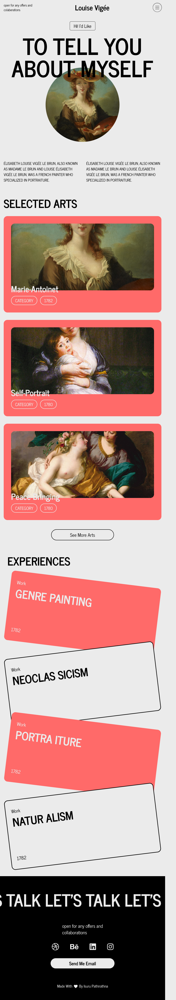

# Louise Vigée UI

## Overview

Welcome to the Topus Louise Vigée UI project. This UI design is inspired by the artistic style of Louise Vigée Le Brun, a renowned portrait painter. It combines classical elegance with modern functionality to create a visually captivating user experience.


## Features

- **Artistic Elegance**: This UI design captures the grace and sophistication seen in Louise Vigée Le Brun's artworks, with a carefully chosen color palette and decorative elements.

- **Responsive Design**: The UI is responsive, ensuring it looks great on various screen sizes, from desktop to mobile.

- **User-Friendly**: While it draws inspiration from the past, the UI design is user-friendly, adhering to modern usability standards.

## Screenshots

 <br/><br/>


## Installation

To set up and experience this UI design locally, follow these steps:

1. Clone the repository:

   ```bash
   git clone https://github.com/Is116/topus-louise-vigee-ui.git
   cd topus-louise-vigee-ui

## Usage

You can use this UI design as inspiration for your own web projects, or integrate it into your existing website for a touch of classical elegance.
Feedback and Contributions

If you have suggestions, feedback, or would like to contribute to this project, please feel free to open an issue or submit a pull request. Your input is highly valued!

## License

This project is licensed under the MIT License.

